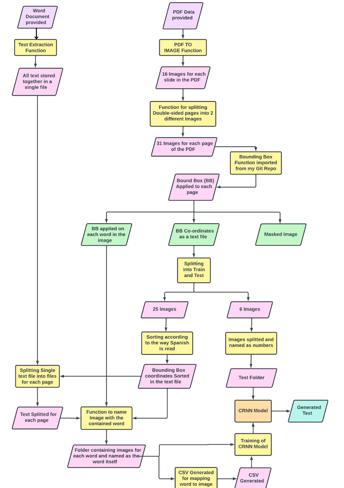
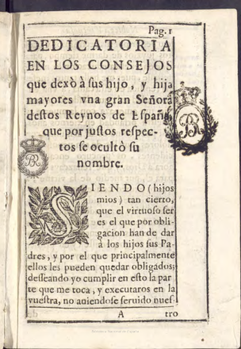
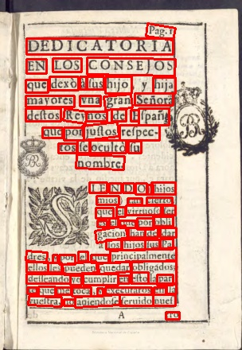
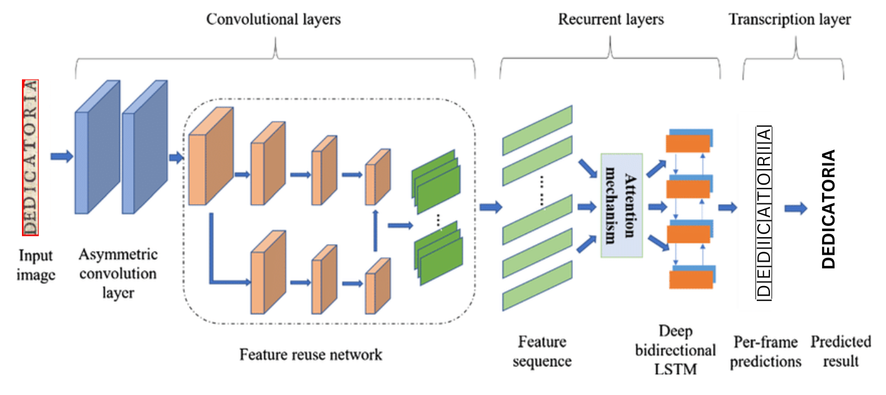
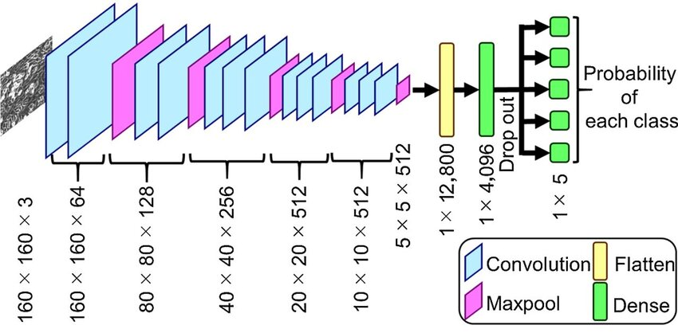
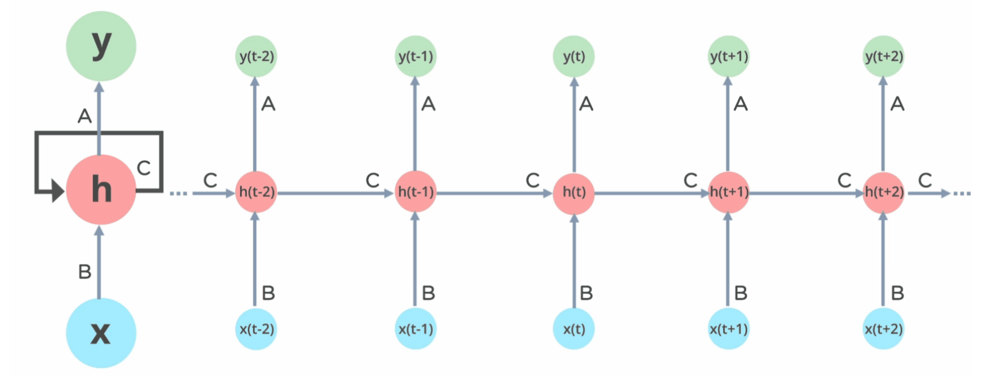
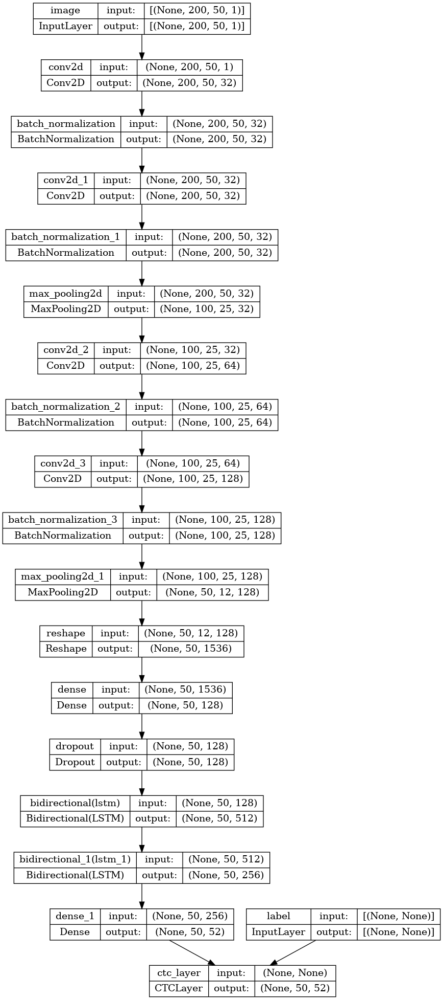
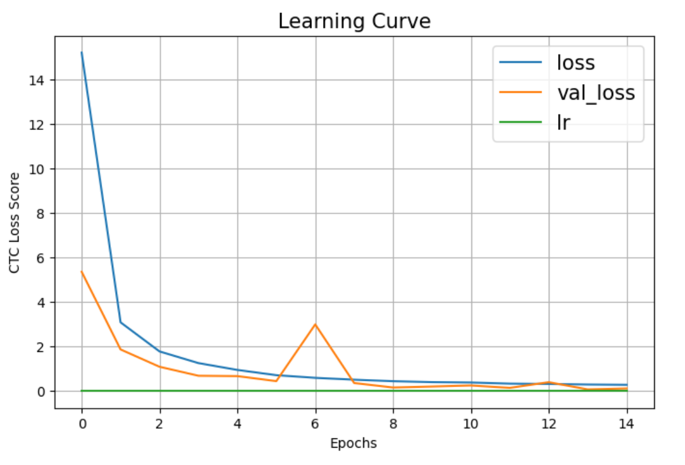

# Historical Text Recognition using CRNN Model

This project addresses the challenge of text recognition from **historical Spanish printed sources** dating back to the **seventeenth century** — a domain where existing Optical Character Recognition (OCR) tools often fail due to the complexity and variability of the texts. Leveraging hybrid end-to-end models based on a combination of CNN and RNN architectures, namely **CRNN**, we develop advanced machine learning techniques capable of accurately transcribing non-standard printed text.

This work was carried out as a project for the course **AI for Programmers (CSO-432)** at the **Indian Institute of Technology (BHU), Varanasi**.

### Team Members

| Name | Roll Number |
|------|-------------|
| Soni Om Bhaveshkumar | 22134036 |
| Shashank Sekhar Singh | 22135115 |
| Sharad Singh | 22135112 |

*4th Year, Mechanical Engineering — IIT BHU*

## Table of Contents

- [Project Goals](#project-goals)
- [Installation](#installation)
- [About The Project](#about-the-project)
- [Datasets and Models](#datasets-and-models)
- [Model Performance](#model-performance)
- [References](#references)
- [License](#license)

## Project Goals

1. **Development of Hybrid End-to-End Models:** The primary goal of this project is to design, implement, and fine-tune hybrid end-to-end models based on CRNN architectures for text recognition. By combining the strengths of recurrent neural networks (RNN) and convolutional neural networks (CNN), the models aim to effectively capture both local and global features in historical Spanish printed text, enhancing accuracy and robustness in transcription.

2. **Achieving High Accuracy:** Our target was to train machine learning models capable of extracting text from seventeenth-century Spanish printed sources with at least **80%** character-level accuracy. This entailed extensive experimentation, hyperparameter tuning, and dataset curation to ensure the models generalize well across various styles, fonts, and degradation levels present in historical documents. Achieving this goal represents a meaningful advancement in text recognition, particularly in the context of preserving and analyzing ancient textual artifacts.

## Installation

You don't need to install anything externally — just fire up the Python notebook on your favourite coding platform (Google Colab, Jupyter Notebook, Kaggle, etc.) and start running the cells one after the other. All required packages are listed in the first code block of the notebook.

### Project Directory Structure

1. **Dataset_Generation.ipynb** — A Python notebook to generate training data from book PDF and transcription files. If you just want to train and test the CRNN model, you can skip this notebook.

2. **Model.ipynb** — A standalone Python notebook used for model training and inference. It is trained on a corrected and modified dataset prepared during the course of the project.

## About The Project

### Irregularities and Ambiguities in 17th-Century Spanish Print

- **Interchangeable Characters**: Characters like `u` & `v`, and `f` & `s` were used interchangeably. Assume `u` at the beginning of a word and `v` inside a word. Assume `s` at the beginning/end of a word, `f` within a word.
- **Tildes** (horizontal "cap" — ignore grave/backwards accents):
    1. When a `q` is capped, assume `ue` follows.
    2. When a vowel is capped, assume `n` follows.
    3. When an `n` is capped, this is always the letter `ñ`.
- **Old Spellings**: `ç` (old spelling) is always modern `z`.
- **Line-End Hyphens**: Some line-end hyphens are not present — words are left split for now.

### Dataset and Pre-processing

- **Input Data:** The main dataset consists of 31 scanned pages. 25 have transcriptions available; the last 6 pages of transcriptions have been held out to evaluate the accuracy and viability of the test method employed.
- **PDF and DOC to Images**: The flowchart below depicts the path followed to generate the dataset for training the CRNN model.
    

- **CRAFT Model**: We use the CRAFT model for word-level bounding box detection and localisation. Sample results:
    

    
    
    

- **Enhancements**: Augmentation techniques including rotation and Gaussian noise addition.

### Model Architecture

- **CRNN Model**: The Convolutional Recurrent Neural Network combines two of the most prominent neural network families. The CRNN involves a CNN (convolutional neural network) followed by an RNN (recurrent neural network).

- **CNN**: CNNs extract spatial features from input images, transforming them into a feature map.

- **RNN**: RNNs then process these features sequentially to capture contextual dependencies and predict character sequences.

- **Current CRNN Architecture**: The model plot below represents the CRNN architecture implemented in our Python notebook.

### Training and Evaluation

- **Hyperparameter Optimization**: Selected through extensive experimentation.
- **Model Calibration**: Utilizes validation loss and other techniques to align sequence likelihoods with quality, improving output accuracy.
- **Evaluation Metrics**: Performance evaluated using CTC Loss and Validation Loss.

- **Loss vs Epochs**: The model is performant and lightweight — it reaches optimal training in just 10–15 epochs.

## Datasets and Models

- The `Padilla - Nobleza virtuosa_testExtract.pdf` can be downloaded from the `data/` folder in this repository.
- The `Padilla - 1 Nobleza virtuosa_testTranscription.docx` can be downloaded from the `data/` folder in this repository.
- The OCR model can be directly generated by running the Python notebook, or downloaded from the `Model/` folder in this repository.

## Model Performance

| Metric | Value |
|--------|-------|
| Character Accuracy | **95.79%** |
| CER (Character Error Rate) | 0.027 |
| CTC Loss | 0.10 |
| Validation Loss | 0.07 |

The model comfortably exceeds the 80% character-accuracy target set at the start of the project.

## References

- Shi, B., Bai, X., & Yao, C. (2015). *An End-to-End Trainable Neural Network for Image-based Sequence Recognition and Its Application to Scene Text Recognition.* [arXiv:1507.05717](https://arxiv.org/abs/1507.05717)
- Reference PyTorch implementation of CRNN: [github.com/meijieru/crnn.pytorch](https://github.com/meijieru/crnn.pytorch)
- Baek, Y., Lee, B., Han, D., Yun, S., & Lee, H. (2019). *Character Region Awareness for Text Detection (CRAFT).*
